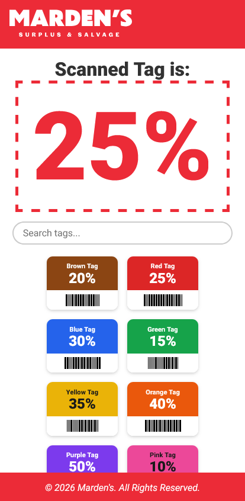

# Mardens Discount QR

A mobile-friendly discount tag lookup for Marden's Surplus & Salvage.

<p align="center">
  
</p>

## Features

- Scan a QR code or tap a color tag to see its discount percentage
- Real-time search/filter by color name or percentage
- 10 color-coded tags (brown through black, 5%–60%)
- URL deep-linking via `?tag=color` query parameter
- Builds to a single HTML file for easy deployment
- Fully responsive (mobile-first)

## Tech Stack

- [Vite](https://vite.dev/) — build tool
- TypeScript
- CSS (no framework)

## Getting Started

```bash
pnpm install
pnpm dev
```

### Build

```bash
pnpm build
```

Output is a single HTML file in `dist/`.
